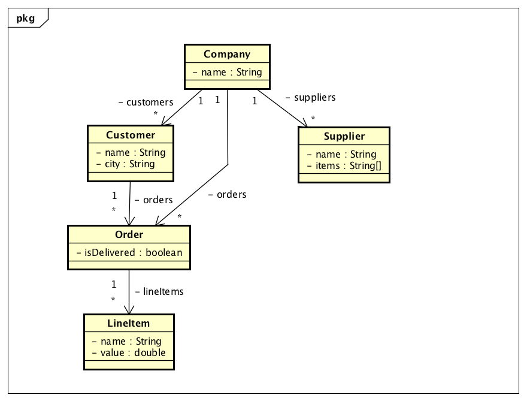
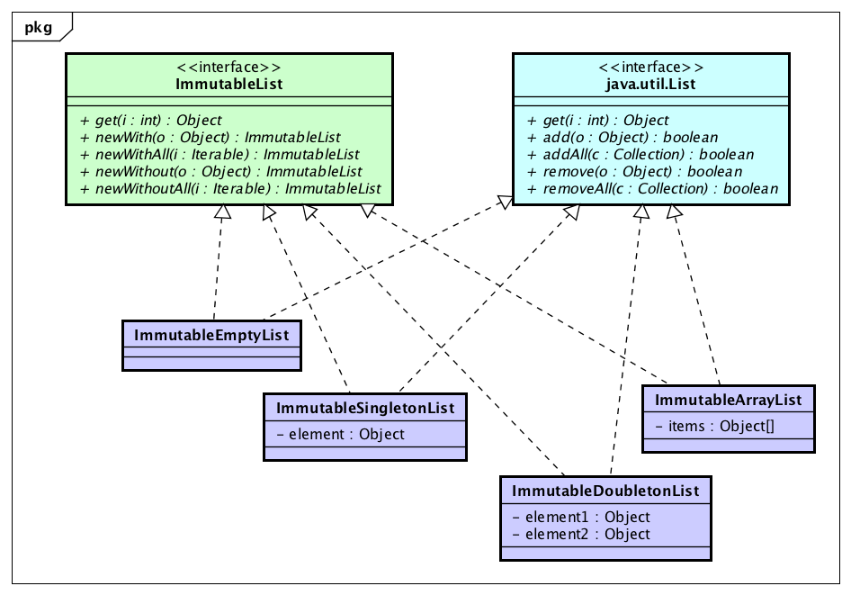

<!--
  ~ Copyright (c) 2020 Goldman Sachs and others.
  ~ All rights reserved. This program and the accompanying materials
  ~ are made available under the terms of the Eclipse Public License v1.0
  ~ and Eclipse Distribution License v. 1.0 which accompany this distribution.
  ~ The Eclipse Public License is available at http://www.eclipse.org/legal/epl-v10.html
  ~ and the Eclipse Distribution License is available at
  ~ http://www.eclipse.org/org/documents/edl-v10.php.
  -->
 <!-- .element style="background-color:aliceblue" -->

Company Kata
============

Learning through exercises

* **space:** next page
* **down arrow:** next page in the current section
* **right arrow:** next section


Iteration Patterns
==================
 * What is an iteration pattern?
 * **Sort** is one example.
 * We want to sort a list of people by last name, first name.
 * Which method in the JCF can we use?

---

```java
Person john = new Person("John", "Smith");
Person jane = new Person("Jane", "Smith");
Person z = new Person("Z.", "Jones");
List<Person> people = new ArrayList<Person>();
people.add(john);
people.add(jane);
people.add(z);
```


#### Javadoc
```java
public static void java.util.Collections.sort(
 List<T> list, Comparator<? super T> c)
```
* Sorts the specified list according to the order induced by the specified
comparator. All elements in the list must be mutually comparable.

---
#### Lambda Syntax
```java
Collections.sort(people, (Person o1, Person o2) -> {
  int lastName = o1.getLastName().compareTo(o2.getLastName());
  if (lastName != 0) {
    return lastName;
  }
  return o1.getFirstName().compareTo(o2.getFirstName());
});
```


#### Javadoc
```java
public static void java.util.Collections.sort(
 List<T> list, Comparator<? super T> c)
```
* Sorts the specified list according to the order induced by the specified
comparator. All elements in the list must be mutually comparable.
* **Does anything bother you about ```Collections.sort()```?**


#### Javadoc
```java
public static void java.util.Collections.sort(
 List<T> list, Comparator<? super T> c)
```
* Sorts the specified list according to the order induced by the specified
comparator. All elements in the list must be mutually comparable.
* **Does anything bother you about ```Collections.sort()```?**

---
#### JCF Problems
* Why isn’t ```sort()``` a method on every List?
```java
Collections.sort(list, comparator);
```
vs.
```java
list.sort(comparator);
```


#### Javadoc
```java
public static void java.util.Collections.sort(
 List<T> list, Comparator<? super T> c)
```
* Sorts the specified list according to the order induced by the specified
comparator. All elements in the list must be mutually comparable.
* **Does anything bother you about ```Collections.sort()```?**

---
#### JCF Problems
* Where are all the iteration patterns?
* java.util.Collections provides methods for ```sort()```, ```min()```, ```max()``` and
just a few others.
* The most common iteration patterns are missing:
  * Collect a list of each person’s address.
  * Select only those people whose age is 18 or higher.


Iteration Patterns
------------------
* We want the methods ```sort()```, ```min()```, ```max()```, ```collect()```, ```select()```, etc.
on every collection.
* How can we accomplish this in code?


#### Iteration Patterns
* We want the methods ```sort()```, ```min()```, ```max()```, ```collect()```, ```select()```, etc.
on every collection.
* How can we accomplish this in code?

---
#### Eclipse Collections Interfaces
```java
public interface MutableList<T> extends List<T>
{
  MutableList<T> sortThis(Comparator<? super T> comparator);
  <V> MutableList<V> collect(Function<? super T, ? extends V> function);
  MutableList<T> select(Predicate<? super T> predicate);
  ...
}
```


#### Collect Pattern
* Collect (aka map or transform).
* Returns a new collection where each element has been transformed
  * e.g. collect each person’s address.
* __Function__ is the type that takes an object and returns an object of a
different type
  * aka Transformer

---
#### JCF Example
```java
List<Person> people = ...
List<Address> addresses = new ArrayList<Address>();
for (Person person : people)
{
  addresses.add(person.getAddress());
}
```


#### Collect Pattern
* __Function__ is the type that takes an object and returns an object of a
different type

---
#### Eclipse Collection Example w/ Anonymous Inner Class
```java
MutableList<Person> people = ...
MutableList<Address> addresses = people.collect(
  new Function<Person, Address>()
  {
  public Address valueOf(Person person)
  {
    return person.getAddress();
  }
});
```


#### Collect Pattern
* __Function__ is the type that takes an object and returns an object of a
different type

---
#### Eclipse Collection Example w/ Lambda & Method Reference
```java
MutableList<Person> people = ...

// Lambda
MutableList<Address> addresses =
  people.collect(person -> person.getAddress());

// Method Reference
MutableList<Address> addresses =
  people.collect(Person::getAddress);
```


#### Collect Pattern
* The loop moves in to the implementation of ```collect()```.
* Let’s look at a realistic implementation of ```collect()``` for ```FastList```.

---
#### Realistic Implementation Example
```java
public <V> MutableList<V> collect(Function<? super T, ? extends V> function)
{
  MutableList<V> result = FastList.newList(this.size);
  for (int i = 0; i < this.size; i++) {
    result.add(function.valueOf(this.items[i]));
  }
  return result;
}
```


#### Select Pattern
* Select (aka filter).
* Returns the elements of a collection that satisfy some condition
  * e.g. select only those people whose age is 18 or higher.
* __Predicate__ is the type that takes an object and returns a boolean.

---
#### JCF Example
```java
List<Person> people = ...
List<Person> adults = new ArrayList<>();
for (Person person : people)
{
  if (person.getAge() >= 18)
  {
      adults.add(person);
  }
}
```


#### Select Pattern
* Select (aka filter).
* Returns the elements of a collection that satisfy some condition
  * e.g. select only those people whose age is 18 or higher.
* __Predicate__ is the type that takes an object and returns a boolean.

---
#### Eclipse Collections Example w/ Anonymous Inner Class
```java
MutableList<Person> people = ...
MutableList<Person> adults = people.select(
  new Predicate<Person>()
  {
    public boolean accept(Person each)
    {
      return each.getAge() >= 18;
    }
});
```


#### Select Pattern
* Select (aka filter).
* Returns the elements of a collection that satisfy some condition
  * e.g. select only those people whose age is 18 or higher.
* __Predicate__ is the type that takes an object and returns a boolean.

---
#### Eclipse Collections Example w/ Lambda
```java
MutableList<Person> people = ...
MutableList<Person> adults =
  people.select(each -> each.getAge() >= 18);
```


#### Iteration Patterns
* __Collect__ returns a new collection where each element has been
transformed.
* __Select__ returns the elements of a collection that satisfy some
condition.

---
#### Code Blocks
* __sortThis()__ takes a __Comparator__, which is a strategy interface.
* __collect()__ takes a __Function__.
* __select()__ takes a __Predicate__.
* Don’t get hung up on these names because the IDE will remind you.


#### Company Kata Domain

 <!-- .element style="width:75%;background-color:aliceblue" -->


#### Company Kata Domain
* LineItems, Companies, Orders, Customers, and Suppliers.
* All tests extend CompanyDomainForKata, which sets up some
customers, suppliers and orders for a company.
* Data is available using getters on ```this.company```
  * For example ```this.company.getCustomers()```;

---
#### Hints
* Most changes will be under ```src/test```.
* Some changes will be under ```src/main```.
* Feel free to refactor the domain under ```src/main```.
* Pay close attention to the Javadoc for instructions and hints.
* Use the IDE support for Javadoc ```@links```.


Exercise 1
----------
* Find ```Exercise1Test```; it has assertion failures if you run it as a test.
* Figure out how to get the tests to pass using what you have seen so far.
* Should take about 15 minutes.

* **right:** Exercise 1 solutions


[Exercise 1 Solutions](https://github.com/eclipse/eclipse-collections-kata/tree/master/company-kata-solutions/src/test/java/org/eclipse/collections/companykata/Exercise1Test.java)
====================


Test Utils
==========


#### Verify
* Eclipse Collections distribution includes ```eclipse-collections-testutils.jar```.
  * Includes helpful utility for writing unit tests.
  * Collection-specific.
  * Implemented as an extension of __JUnit__.
  * Most important class is called ```Verify```.

---
#### Code Example
Example from the previous solution
```java
Verify.assertSize(2, customersFromLondon);
```
Instead of
```java
Assert.assertEquals(2, customersFromLondon.size());
```


#### Verify
* Several other self-explanatory examples:

---
#### Code Example
```java
Verify.assertEmpty(Lists.mutable.empty());
Verify.assertNotEmpty(Lists.mutable.with(1));
Verify.assertContains(1, Lists.mutable.with(1));
```


#### Verify
* It’s possible to go too far.
* The first form is more verbose.
* The second form asserts more because of the contract of equals().
---
#### Bad
```java
Verify.assertSize(3, list);
Verify.assertContainsAll(list, 1, 2, 3);
```
#### Good
```java
Assert.assertEquals(Lists.mutable.with(1, 2, 3), list);
```


Benefits of Eclipse Collections
===============================


#### Pros
* Increased readability.
* Reduced duplication – less to test.
* Simplified iteration.
* Optimized by type for memory and speed.
---
#### Cons
* Before Java 8 there were no lambdas or closures
  * Verbose anonymous inner class syntax


#### Readability
* __Object-oriented programming__ is a paradigm that groups data with the
methods that predicates on the data.
* __Functional programming__ is a paradigm that treats computation as the
evaluation of mathematical functions and avoids state and mutable data.
* Possible to merge the two paradigms and wind up with very readable
code.
* Where they sometimes clash is mutable state.


#### Example
```
x = 5
x = 6
```
---
#### Java
* In Java this is OK.
* The value of x changes over time.
---
#### Math
* In pure math this makes no sense.
* The value of x is 5, it cannot be reassigned.


#### Imperative Programming
* In imperative programming, __time__ is important.
* The truth of conditions changes with the state of the program.
* This can decrease readability.
  * can be difficult to reason about.
  * can be difficult to test.
* Think architecture that is concurrent and based on asynchronous
callbacks.
---
#### Code Example
```java
List<Person> people = ...
List<Address> addresses = new ArrayList<Address>();
// Not true yet! It’s an empty list, not a list of addresses!
for (Person person : people)
{
  addresses.add(person.getAddress());
}
```


#### Imperative vs. Functional
* ```fibonacci()``` function returns the same output for the same input.
* We can tell it doesn’t use mutable state; it can be static.
* Iterators are not functional.
* ```next()``` takes no input, yet returns different values over time.
* It obviously uses internal state.
---
#### Code Example
```java
for (int i = 0; i < 10; i++)
{
 System.out.println(this.fibonacci(i));
}
// vs.
for (int i = 0; i < 10; i++)
{
 System.out.println(this.fibonacciIterator.next());
}
```


#### Benefits
* Iteration patterns are methods on our collections.
* Simply naming the patterns enhances readability:
```java
people.collect(...)
```
---
#### Drawbacks
* These methods take a parameter which is a bit of code:
  * how to collect or select.
* The thing inside the parentheses is now less readable:
  * represented as an anonymous inner class.


#### Readability
* Ideally, Java would have native support for anonymous functions (aka
lambda expressions, erroneously aka closures).
* The syntax below works with Java 8+.
---
#### Eclipse Collections w/ Java 8
```java
MutableList<Person> people = ...;

// Lambda
MutableList<Address> addresses =
  people.collect(person -> person.getAddress());

// Method Reference
MutableList<Address> addresses =
  people.collect(Person::getAddress);
```


#### Readability
* We have other tricks for dealing with boilerplate code.
* Eclipse Collections provides several “lambda factories,” like ```Predicates```.
---
#### Eclipse Collections w/ Predicates Factory
```java
MutableList<Integer> mutableList =
  Lists.mutable.with(25, 50, 75, 100);
 
MutableList<Integer> selected =
  mutableList.select(Predicates.greaterThan(50));
```


#### Readability
* ```Predicates``` also lets you create common Predicates from Functions.
* Combines well with the previous tip.
---
#### Eclipse Collections w/ Predicates Factory
```java
MutableList<Person> people = ...;

MutableList<Person> theSmiths = people.select(
  Predicates.attributeEqual(Person::getLastName, "Smith"));
```


Inheritance Hierarchy
---------------------
* ```MutableList``` extends List.
* ```FastList``` is a drop-in replacement for ```ArrayList```.
* ```FastList``` could extend ArrayList, but we chose not to.
* Iteration patterns were pulled up higher into ```RichIterable```.


Inheritance Hierarchy
---------------------
* ```MutableSet``` extends ```Set```.
* ```UnifiedSet``` is a drop in replacement for HashSet.
* Everything about Lists is analogous for Sets (and Bags).
* This is why iteration patterns were pulled up higher into ```RichIterable```
  * ```min()``` for example is identical across collection types.


Inheritance Hierarchy
---------------------
* ```MutableMap``` extends ```Map```.
* ```UnifiedMap``` is a drop in replacement for ```HashMap```


Immutability
============


#### Pros
* Why would we prefer immutable data structures?

---
#### Cons
* Why wouldn’t we prefer immutable data structures?


#### Pros
* Easier to reason about because no complex state changes over time.
* Can pass them around without making defensive copies.
* Safe for concurrent access and as hash-table keys.
* If an object is mutated after it is placed into a ```HashSet```, that object may not be found the next time you look.
---
#### Cons
* Can require large object graph to be copied where otherwise an update could be done in place.
* It is common for libraries to provide mutable alternatives to immutable classes.
  * For example, ```StringBuilder``` is a mutable alternative to ```String```


#### Conversion Methods
* ```toList()```, ```toSortedList()```, ```toSet()```, ```toSortedSet()```, ```toBag()```
* Return mutable copies.
* Return new copy even when called on a collection of the same type.
---
#### Code Example
```java
MutableList<Integer> list = Lists.mutable.with(3, 1, 2, 2, 1);

MutableList<Integer> noDupes = list.toSet().toSortedList();

Assert.assertEquals( Lists.mutable.with(1, 2, 3), noDupes);
```


#### Immutable List Design

 <!-- .element style="width: 75%;background-color:aliceblue" -->


#### Immutable Collection
* ```ImmutableCollection``` interface does not extend ```java.util.Collection```:
  * No mutating methods.
  * Mutating requires a new copy.
* Eclipse Collections also has “memory-efficient” collections but they are largely
superseded by ```ImmutableCollections```.
---
#### Truly Immutable
```java
ImmutableList<Integer> immutableList =
  Lists.mutable.with(1, 2, 3).toImmutable();

ImmutableList<Integer> immutableList2 =
  Lists.immutable.of(1, 2, 3);

Verify.assertInstanceOf(ImmutableTripletonList.class, immutableList);
```


#### Equality
* Should a mutable list equal an immutable list?

---
#### Code Example
```java
MutableList<Integer> mutable =
  Lists.mutable.with(1, 2, 3);

ImmutableList<Integer> immutable =
  Lists.immutable.with(1, 2, 3);

mutable.equals(immutable);
```


#### Equality
* Should a list and a set be equal?

---
#### Code Example
```java
MutableList<Integer> list =
  Lists.mutable.with(1, 2, 3);

MutableSet<Integer> set =
  Sets.mutable.with(1, 2, 3);

list.equals(set);
```


#### Equality
* Should a mutable list equal an immutable list?
* A list is a ```List``` because it allows duplicates and preserves order, so yes.
---
#### Code Example
```java
MutableList<Integer> mutable =
  Lists.mutable.with(1, 2, 3);

ImmutableList<Integer> immutable =
  Lists.immutable.with(1, 2, 3);

mutable.equals(immutable);
```


#### Equality
Here’s the implementation of ```ArrayList.equals()```, really on ```AbstractList```:
```java
public boolean equals(Object o) {
  if (o == this)
    return true;
  if (!(o instanceof List))
    return false;
  ListIterator<E> e1 = this.listIterator();
  ListIterator e2 = ((List) o).listIterator();
  while (e1.hasNext() && e2.hasNext()) {
    E o1 = e1.next();
    Object o2 = e2.next();
    if (!(o1 == null ? o2 == null : o1.equals(o2))) {
      return false;
    }
  }
  return !(e1.hasNext() || e2.hasNext());
}
```


#### Overview
* Implementations are Collections in order to satisfy the existing
contract of equals() on ```List``` and ```Set```.
* Can be cast to ```Collection```.
* Brings back the mutating methods.
* Brings back the ```UnsupportedOperationExceptions```.
* Convenient for interop.
---
#### Structurally Immutable
```java
List<Integer> list = immutableList.castToList();
Verify.assertThrows(
  UnsupportedOperationException.class,
  () -> list.add(4););
```


More Iteration Patterns
=======================


#### Other Patterns that use Predicate
* __Select__ returns the items that satisfy the ```Predicate```.
* __Reject__ returns the items that do not satisfy the ```Predicate```.
* __Count__ returns the # of items that satisfy the ```Predicate```.
---
#### Short-ciruit patterns that use Predicate
* __Detect__ finds the first item that satisfies the ```Predicate```.
* __AnySatisfy__ returns true if any item satisfies the ```Predicate```.
* __AllSatisfy__ returns true if all items satisfy the ```Predicate```.
* __NoneSatisfy__ returns true if no items satisfy the ```Predicate```.


Exercise 2
----------
* Fix ```Exercise2Test```.
* Use the other iteration patterns that take a ```Predicate```.
* Should take about 20 minutes.


[Exercise 2 Solutions](https://github.com/eclipse/eclipse-collections-kata/tree/master/company-kata-solutions/src/test/java/org/eclipse/collections/companykata/Exercise2Test.java)
====================


Advanced TestUtils
==================


#### Verify
* ```Verify``` includes additional assertions based on iteration patterns.

---
#### Code Example
```Java
MutableList<Integer> list =
  Lists.mutable.with(1, 2, 0, -1);

Verify.assertAllSatisfy(list, IntegerPredicates.isPositive());

junit.framework.AssertionFailedError: The following
  items failed to satisfy the condition <[0, -1]>
```


Target Collections
==================


#### Iteration Pattern
* Let's say we have 3 people: mrSmith, mrsSmith, mrJones.
* The first two share the same address.
* What will get printed by the following code?
---
#### Example Code
```Java
MutableSet<Person> people =
  Sets.mutable.with(mrSmith, mrsSmith, mrJones);

int numAddresses =
  people.collect(addressFunction).size();

System.out.println(numAddresses);
```


#### Covariant return types
* ```select()```, ```collect()```, etc. are defined with covariant return types:
* ```MutableCollection.collect()``` returns a ```MutableCollection```
* ```MutableList.collect()``` returns a ```MutableList```
* ```MutableSet.collect()``` returns a ```MutableSet```
* Alternate forms take target collections.
---
#### Example Code
```Java
MutableSet<Person> people =
  Sets.mutable.with(mrSmith, mrsSmith, mrJones);

int numAddresses =
  people.collect(addressFunction).size();

System.out.println(numAddresses);
```


#### Covariant return types
* ```select()```, ```collect()```, etc. are defined with covariant return types:
* ```MutableCollection.collect()``` returns a ```MutableCollection```
* ```MutableList.collect()``` returns a ```MutableList```
* ```MutableSet.collect()``` returns a ```MutableSet```
* Alternate forms take target collections.
---
#### Example Code
```Java
MutableSet<Person> people = Sets.mutable.with(mrSmith, mrsSmith, mrJones);

MutableList<Address> targetList = Lists.mutable.empty();

int numAddresses = people.collect(addressFunction, targetList).size();

System.out.println(numAddresses);
```


FlatCollect Pattern
===================


#### Background on Collect
* ```flatCollect()``` is a special case of ```collect()```.
* With ```collect()```, when the ```Function``` returns a collection, the result is a
collection of collections.
---
#### Code Example
```Java
MutableList<Person> people = ...;

Function<Person, MutableList<Address>> addressesFunction =
  person -> person.getAddresses();

MutableList<MutableList<Address>> addresses =
  people.collect(addressesFunction);
```


#### FlatCollect
* ```flatCollect()``` outputs a single “flattened” collection instead of a
collection of collections.
* The signature of ```flatCollect()``` is similar to ```collect()```, except that the
```Function``` parameter must map to an ```Iterable``` type.
```Java
flatCollect(Function<? super T, ? extends Iterable<V>> function);
```
---
#### Code Example
```Java
MutableList<Person> people = ...;
MutableList<Address> addresses = people.flatCollect(person -> person.getAddresses());
```


#### Collect
```Java
MutableList<MutableList<Address>> addresses =
  people.collect(Person::getAddresses);
```
---
#### FlatCollect
```Java
MutableList<Address> addresses =
  people.flatCollect(Person::getAddresses);
```


Exercise 3
----------
* Fix ```Exercise3Test```.
* Should take about 20 minutes


[Exercise 3 Solutions](https://github.com/eclipse/eclipse-collections-kata/tree/master/company-kata-solutions/src/test/java/org/eclipse/collections/companykata/Exercise3Test.java) 
====================


Static Utility
==============


#### Iteration Pattern
* Using methods on the interfaces is the preferred, object-oriented
approach.

---
#### Eclipse Collections Select with Predicates Factory
```Java
MutableList<Integer> mutableList = ...;

MutableList<Integer> selected =
  mutableList.select(Predicates.greaterThan(50));
```


#### Iteration Pattern
* Using methods on the interfaces is the preferred, object-oriented
approach.
  * But it’s not always feasible.
* Static utility classes like ```Iterate```, ```ListIterate```, etc. provide
interoperability with JCF.
---
#### Eclipse Collections Select with Static Utility
```Java
List<Integer> list = ...;

MutableList<Integer> selected =
  ListIterate.select(list, Predicates.greaterThan(50));
```


#### Iteration Pattern
* Using methods on the interfaces is the preferred, object-oriented
approach.
  * But it’s not always feasible.
* Static utility classes like ```Iterate```, ```ListIterate```, etc. provide
interoperability with JCF.
* Static utility classes like ```ArrayIterate``` and ```StringIterate``` show that
iteration patterns work on other types as well.
---
#### Eclipse Collections Select with Static Utility
```Java
Integer[] array = ...;
MutableList<Integer> selected =
  ArrayIterate.select(array, Predicates.greaterThan(50));

String string = StringIterate.select( "1a2a3", CharPredicate.IS_DIGIT);

Assert.assertEquals("123", string);
```


#### Iteration Pattern
* Static utility for parallel iteration.
* Hides complexity of writing concurrent code.
* Looks like the serial case.
* Notice the lack of locks, threads, pools, executors, etc.
* Order is preserved in the result.
---
```Java
List<Integer> list = ...;

Collection<Integer> selected =
  ParallelIterate.select(list, Predicates.greaterThan(50));
```


#### Static Utility Cheat Sheet
* Iterate Iterable) 
  * ListIterate (List)
  * ArrayListIterate (ArrayList)
  * RandomAccessListIterate (List & RandomAccess)
* MapIterate (Map)
* LazyIterate (Iterable)
* ArrayIterate (T[])
* StringIterate (String)
* ParallelIterate (Iterable)
* ParallelMapIterate (Map)
* ParallelArrayIterate (T[])


Benefit of the OO API
=====================


#### Static Utility
* Let’s look at the full implementation of Collections.sort()
* What’s wrong with this code?
---
#### JCF Sort
```Java
public static <T> void sort(List<T> list, Comparator<? super T> c) {
  Object[] array = list.toArray();
  Arrays.sort(array, (Comparator) c);
  ListIterator iterator = list.listIterator();
  for (int i = 0; i < array.length; i++) {
    iterator.next();
    iterator.set(array[i]);
  }
}
```


#### Static Utility
* This code is fine for LinkedList.
* The code is suboptimal for ArrayList (and FastList).
  * Unnecessary array copy.
  * Unnecessary iterator created.
  * Unnecessary calls to set().
---
#### JCF Sort
```Java
public static <T> void sort(List<T> list, Comparator<? super T> c) {
  Object[] array = list.toArray();
  Arrays.sort(array, (Comparator) c);
  ListIterator iterator = list.listIterator();
  for (int i = 0; i < array.length; i++) {
    iterator.next();
    iterator.set(array[i]);
  }
}
```


#### Object-Oriented
* FastList has a simpler and more optimal implementation.
* Objects group logic with the data it operates on.
* This logic makes sense for an array-backed structure.
---
```Java
public FastList<T> sortThis(Comparator<? super T> comparator)
{
  Arrays.sort(this.items, 0, this.size, comparator);
  return this;
}
```


Exercise 4
----------
* Fix the five methods in ```Exercise4Test```.
* Solve them using the static utility classes.
* Exercise 4 should take about 25 minutes.


[Exercise 4 Solutions](https://github.com/eclipse/eclipse-collections-kata/tree/master/company-kata-solutions/src/test/java/org/eclipse/collections/companykata/Exercise4Test.java)
====================


Refactoring to Eclipse Collections
==================================


#### Before
```Java
List<Integer> integers = new ArrayList<Integer>();
integers.add(1);
integers.add(2);
integers.add(3);
```
---
#### After
```Java
List<Integer> integers = new FastList<Integer>();
integers.add(1);
integers.add(2);
integers.add(3);
```
---
#### Why?
* ```FastList``` is a drop-in replacement for ```ArrayList```.
* More memory efficient.
* Opens up the refactoring opportunities coming up next.


#### Before
```Java
List<Integer> integers = new FastList<Integer>();
integers.add(1);
integers.add(2);
integers.add(3);
```
---
#### After
```Java
List<Integer> integers = Lists.mutable.empty();
integers.add(1);
integers.add(2);
integers.add(3);
```
---
#### Why?
* The static factory methods can infer generic types.


#### Before
```Java
List<Integer> integers = Lists.mutable.empty();
integers.add(1);
integers.add(2);
integers.add(3);
```
---
#### After
```Java
List<Integer> integers = Lists.mutable.with(1, 2, 3);
```
---
#### Why?
* Varargs support; any number of arguments.
* Never mutated; so you could make it unmodifiable:
```Java
Lists.mutable.with(1, 2, 3).asUnmodifiable();
```
* There is also a form that takes another iterable:
```Java
Lists.mutable.withAll(list);
```


#### Before
```Java
List<Integer> integers = Lists.mutable.with(1, 2, 3);
```
---
#### After
```Java
MutableList<Integer> integers = Lists.mutable.with(1, 2, 3);
```
---
#### Why?
* ```MutableList``` is a drop in replacement for ```List```
* Methods available on interface instead of utility classes.
* Better type information:
  * ```Iterate.select()``` returns a ```Collection```, but
  * ```MutableList.select()``` returns a ```MutableList```


#### Sets and Maps
* These refactorings are analogous for UnifiedSet and UnifiedMap

---
#### Code Examples
```Java
MutableSet<Integer> set = 
  Sets.mutable.with(1, 2, 3);

 MutableMap<Integer, String> map = 
  Maps.mutable.with(
    1, "1",
    2, "2",
    3, "3");
```


Exercise 5
----------
* Fix ```Exercise5Test```.
* Two of the ones you just solved.
* This time, don’t use static utility, refactor the domain instead.
* Exercise 5 should take about 10 minutes


[Exercise 5 Solutions](https://github.com/eclipse/eclipse-collections-kata/tree/master/company-kata-solutions/src/test/java/org/eclipse/collections/companykata/Exercise5Test.java)
====================


#### Working Effectively with Legacy Code
* Book by Michael C. Feathers
* “The primary purpose of a compiler is to translate 
source code into some other form, but in statically
typed languages, you can do much more with a
compiler. You can take advantage of its type
checking and use it to identify changes you need
to make. I call this practice leaning on the compiler.”
* Lean on the IDE and the Compiler


More Iteration Patterns
=======================


#### Patterns seen so far
* ```select``` returns the items that satisfy a ```Predicate```.
* ```reject``` returns the items that do not satisfy a ```Predicate```.
* ```count``` returns the number of items that satisfy the ```Predicate```.
* ```collect``` transforms the items using a ```Function```.
* ```flatCollect``` transforms & flattens using a ```Function```.
* ```detect``` finds the first item that satisfies a ```Predicate```.
* ```anySatisfy``` returns true if any item satisfies a ```Predicate```.
* ```allSatisfy``` returns true if all items satisfy a ```Predicate```.
* ```noneSatisfy``` returns true if none satisfy a ```Predicate```.


#### Additional Patterns
* ```forEach``` executes the ```Procedure``` on each item.
* ```injectInto``` injects an accumulator and executes a ```Function2``` 
over each item passing the accumulated result.
* ```chunk``` splits the collection into chunks of the given size.
* ```zip``` joins two collections into a collection of Pairs.
* ```makeString``` like ```toString()```, with a customizable separator, start,
and end string.
* ```appendString``` like ```makeString()```, but uses the specified ```Appendable```.


#### Additional Patterns
* ```toList```/```toSet``` converts the collection to a new copy of the correct type.
* ```toSortedList``` returns a new list sorted according to some Comparator.
* ```sortThis``` sorts the list in place (mutating method) according to
some ```Comparator```.
* ```min```/```max``` returns the min / max element of a collection according
to some ```Comparator```.


#### makeString()
* ```makeString()``` returns a ```String``` representation, similar to ```toString()```.
* Three forms:
  * ```makeString(start, separator, end)```
  * ```makeString(separator)``` defaults start and end to empty strings
  * ```makeString()``` defaults the separator to ", " (comma and space)
---
#### Code Example
```Java
MutableList<Integer> list = Lists.mutable.with(1, 2, 3);
assertEquals("[1/2/3]", list.makeString("[", "/", "]"));
assertEquals("1/2/3", list.makeString("/"));
assertEquals("1, 2, 3", list.makeString());
assertEquals(list.toString(), list.makeString("[", ", ", "]"));
```


#### appendString()
* ```appendString()``` is similar to ```makeString()```, but it appends to an
```Appendable``` and is void.
  * Common Appendables are ```StringBuilder```, ```PrintStream```, ```BufferedWriter```, etc.
  * Same three forms, with additional first argument, the ```Appendable```.
---
#### Code Example
```Java
MutableList<Integer> list = Lists.mutable.with(1, 2, 3);
Appendable appendable = new StringBuilder();
list.appendString(appendable, "[", "/", "]");
assertEquals("[1/2/3]", appendable.toString());
```


#### chunk()
* ```chunk()``` splits a ```RichIterable``` into fixed size pieces.
* Final chunk will be smaller if the size doesn't divide evenly.
---
```Java
MutableList<Integer> list =
  Lists.mutable.with(1, 2, 3, 4, 5, 6, 7, 8, 9, 10);
RichIterable<RichIterable<Integer>> chunks =
list.chunk(4);
System.out.println(chunks);
// prints [[1, 2, 3, 4], [5, 6, 7, 8], [9, 10]]
```


#### zip()
* ```zip()``` takes a second ```RichIterable``` and pairs up all the elements.
* If one of the two ```RichIterable```s is longer, its extra elements are ignored.
---
#### Code Example
```Java
MutableList<String> list1 = 
  Lists.mutable.with("One", "Two", "Three", "Truncated");

MutableList<String> list2 =
  Lists.mutable.with("Four", "Five", "Six");

MutableList<Pair<String, String>> pairs = list1.zip(list2);

System.out.println(pairs);
// prints [One:Four, Two:Five, Three:Six]
```


#### zipWithIndex()
* A special case is when you want to ```zip()``` the elements in a collection with
their index positions.
* You could accomplish that with ```zip()``` and Interval, or use
```zipWithIndex()```.
---
#### Code Example
```Java
MutableList<String> list =
  Lists.mutable.with("One", "Two", "Three");

MutableList<Pair<String, Integer>> pairs =
  list.zipWithIndex();

System.out.println(pairs);
// prints [One:0, Two:1, Three:2]
```


#### min() and max()
* ```min()``` and ```max()``` take a ```Comparator``` and return the extreme elements.
* Overloads don’t take a Comparator.
* If the elements are not ```Comparable```, you get a ```ClassCastException```.
* What if you don’t want the maximum age, but instead the oldest Person?
---
#### Code Example
```Java
MutableList<Person> people = ...;
Integer maxAge = people.collect(Person.TO_AGE).max();
```


#### minBy() and maxBy()
* ```min()``` and ```max()``` take a ```Comparator``` and return the extreme elements.
* Overloads don’t take a ```Comparator```.
  * If the elements are not ```Comparable```, you get a ```ClassCastException```.
* What if you don’t want the maximum age, but instead the oldest Person?
  * Use ```minBy()``` and ```maxBy()``` instead.
---
#### Code Example
```Java
MutableList<Person> people = ...;
Integer maxAge = people.collect(Person.TO_AGE).max();
Person oldestPerson = people.maxBy(Person.TO_AGE);
```


#### toSortedList() and sortThisBy()
* ```toSortedList()``` takes a ```Comparator``` and returns a new sorted list.
* Overload doesn’t take a ```Comparator```.
  * If the elements are not ```Comparable```, you get a ```ClassCastException```.
* What if you don’t want to sort the ages, but instead sort the people by
age?
  * Use ```sortThisBy()``` instead
---
```Java
MutableList<Person> people = ...;
MutableList<Integer> sortedAges =
  people.collect(Person.TO_AGE).toSortedList();
MutableList<Person> peopleSortedByAge =
  people.toSortedListBy(Person.TO_AGE);
```


Exercise 6
----------
* Fix ```Exercise6Test```.
* Exercises use some of the iteration patterns you have just learned.
* Some use a combination of iteration patterns you have already seen.
* Exercise 6 should take about 20 minutes.


[Exercise 6 Solutions](https://github.com/eclipse/eclipse-collections-kata/tree/master/company-kata-solutions/src/test/java/org/eclipse/collections/companykata/Exercise6Test.java)
====================


Stack
=====


#### Stack
* ```java.util.Stack``` extends ```Vector```
* How does ```java.util.Stack``` iterate?
---
#### JCF Problems
```Java
java.util.Stack stack = new java.util.Stack();
stack.push(1);
stack.push(2);
stack.push(3);
System.out.println(stack);
// Prints [1, 2, 3]
```


#### Eclipse Collections Stack
* ```ArrayStack``` is not a drop-in replacement for ```java.util.Stack```.
* ```MutableStack``` does not extend ```java.util.Collection```.


#### push()
* ```push()``` adds an item to the top of the ```MutableStack```

---
#### Code Example
```Java
MutableStack<Integer> stack =
  Stacks.mutable.with(1, 2, 3);
System.out.println(stack);
// Prints [3, 2, 1]
stack.push(4);
System.out.println(stack);
// Prints [4, 3, 2, 1]
```


#### Code Examples
* The different ways to create a MutableStack

```Java
System.out.println(Stacks.mutable.with(1, 2, 3));
// Prints [3, 2, 1]

System.out.println(
Stacks.mutable.withReversed(1, 2, 3));
// Prints [1, 2, 3]

System.out.println(
Stacks.mutable.withAll(Lists.mutable.with(1, 2, 3)));
// Prints [3, 2, 1]

System.out.println(
 Stacks.mutable.withAllReversed(
 Lists.mutable.with(1, 2, 3)));
// Prints [1, 2, 3]
```


#### pop()
* Overloaded ```pop()``` methods:
  * ```pop()```
  * ```pop(int count)```
  * ```pop(int count, R targetCollection)```
---
#### Code Examples
```Java
MutableStack<Integer> stack1 = Stacks.mutable.with(1, 2, 3);
Assert.assertEquals(
  Lists.mutable.with(3, 2),
  stack1.pop(2));
MutableStack<Integer> stack2 = Stacks.mutable.with(1, 3, 3);
Assert.assertEquals(
  Sets.mutable.with(3),
  stack2.pop(2, Sets.mutable.empty()));
MutableStack<Integer> stack3 = Stacks.mutable.with(1, 2, 3);
Assert.assertEquals(
  Stacks.mutable.with(3, 2),
  stack3.pop(2, Stacks.mutable.empty()));    
```


#### peek and peek(int count)
* ```MutableStack``` has an overloaded ```peek()``` method that returns a ```ListIterable```

---
#### Code Example
```Java
MutableStack<Integer> stack =
  Stacks.mutable.with(1, 2, 3);
Assert.assertEquals(
  Integer.valueOf(3),
  stack.peek());
Assert.assertEquals(
  Lists.mutable.with(3, 2),
  stack.peek(2));
```


#### MutableStack
* ```MutableStack``` does not extend ```java.util.List``` (or ```Collection```)

---
#### JCF Problems
```Java
java.util.Stack stack = new java.util.Stack();
stack.push(1);
stack.push(2);
stack.push(3);
Assert.assertEquals(Lists.mutable.with(1, 2, 3), stack);
stack.add(2, 4);
Assert.assertEquals(Lists.mutable.with(1, 2, 4, 3), stack);
stack.remove(1);
Assert.assertEquals(Lists.mutable.with(1, 4, 3), stack);
```


#### Stack API
| Methods                   | Inherited From |
| ------------------------- | -------------- |
| ```select()```, ```collect()```, etc. | ```RichIterable```   |
| ```peek()```                          | ```Stack Iterable``` |
| ```push()```, ```pop()```             | ```MutableStack```   |
---
#### Code Example
```Java
StackIterable<Integer> stack =
  Stacks.mutable.withReversed(1, 2, 3, 4, 5);
StackIterable<Integer> evens = stack.select(integer ->
{
  System.out.print(integer + " ");
  return integer % 2 == 0;
});
// Prints 1 2 3 4 5
Assert.assertEquals(Stacks.mutable.withReversed(2, 4), evens);
```


Bag
===


#### Bag
* Useful when you would otherwise use ```Map<K, Integer>```
  * For example, find the number of people who live in each state
---
#### Code Example
```Java
MutableList<Person> people = ...;
MutableList<String> usStates = people.collect(US_STATE_FUNCTION);
MutableMap<String, Integer> stateCounts = Maps.mutable.empty();

...

int newYorkers = stateCounts.get("NY");
```


#### Bag
* Useful when you would otherwise use ```Map<K, Integer>```
  * For example, find the number of people who live in each state.
  * Lots of boilerplate code to deal with uninitialized counts.
---
#### 🙁 Map Example 🙁 
```Java
MutableList<String> usStates = people.collect(US_STATE_FUNCTION);
MutableMap<String, Integer> stateCounts = Maps.mutable.empty();
for (String state : usStates) {
  Integer count = stateCounts.get(state);
  if (count == null) {
    count = 0;
  }
  stateCounts.put(state, count + 1);
}
```


#### 🙁 Before 🙁
```Java
MutableList<String> usStates = people.collect(US_STATE_FUNCTION);
MutableMap<String, Integer> stateCounts = Maps.mutable.empty();
for (String state : usStates) {
  Integer count = stateCounts.get(state);
  if (count == null) {
    count = 0;
  }
  stateCounts.put(state, count + 1);
}
```
---
#### 😐 After 😐
```Java
MutableList<String> usStates = people.collect(US_STATE_FUNCTION);
MutableBag<String> stateCounts = Bags.mutable.empty();
for (String state : usStates) {
  stateCounts.add(state);
}
int newYorkers = stateCounts.occurrencesOf("NY");
```


#### 😐 Before 😐
```Java
MutableList<String> usStates = people.collect(US_STATE_FUNCTION);
MutableBag<String> stateCounts = Bags.mutable.empty();
for (String state : usStates) {
  stateCounts.add(state);
}
int newYorkers = stateCounts.occurrencesOf("NY");
```
---
#### 😀 After 😀
```Java
MutableList<String> usStates = people.collect(US_STATE_FUNCTION);
MutableBag<String> stateCounts = usStates.toBag();

int newYorkers = stateCounts.occurrencesOf("NY");
```
---
#### 😃 Eclipse Collections 9.0 😃
```Java
MutableBag<String> stateCounts = people.countBy(US_STATE_FUNCTION);

int newYorkers = stateCounts.occurrencesOf("NY");
```


#### Bag
* Implemented as a map of key to count.
* Like a ```List```, but unordered.
* Like a ```Set```, but allows duplicates.
---
#### 😃 Bag Example using countBy 😃
```Java
MutableBag<String> stateCounts = people.countBy(US_STATE_FUNCTION);

int newYorkers = stateCounts.occurrencesOf("NY");
```


#### Bag API
Methods | Inherited From
--- | ---
```select()```, ```collect()```, etc. | ```RichIterable```
```add()```, ```remove()```, ```iterator()```, etc. | ```MutableCollection``` (```java.util.Collection```)
```occurrencesOf()```, ```forEachWithOccurrences()```, ```toMapOfItemToCount()``` | ```Bag```
```addOccurrences()```, ```removeOccurrences()``` | ```MutableBag```


#### Code Example
```Java
MutableBag<String> bag = 
  Bags.mutable.with("one", "two", "two", "three", "three", "three");

Assert.assertEquals(3, bag.occurrencesOf("three"));

bag.add("one");
Assert.assertEquals(2, bag.occurrencesOf("one"));

bag.addOccurrences("one", 4);
Assert.assertEquals(6, bag.occurrencesOf("one"));
```


Multimap
========


#### Multimap
* ```Multimap``` is similar to ```Map```, but associates a key to multiple values.
* Useful when you would otherwise use ```Map<K, Collection<V>>```
  * For example, find which people live in each state.
---
#### Code Example
```Java
MutableList<Person> people = ...;
MutableMap<String, MutableList<Person>> statesToPeople =
  Maps.mutable.empty();

...

MutableList<Person> newYorkers = statesToPeople.get("NY"); 
```


#### Multimap
* ```Multimap``` is similar to ```Map```, but associates a key to multiple values.
* Useful when you would otherwise use ```Map<K, Collection<V>>```
  * For example, find *which* people live in each state.
  * Lots of boilerplate code to deal with uninitialized backing collections.


#### 🙁 Map Example 🙁
```Java
MutableMap<String, MutableList<Person>> statesToPeople =
  Maps.mutable.empty();
for (Person person : people) {
  String state = US_STATE_FUNCTION.valueOf(person);
  MutableList<Person> peopleInState = statesToPeople.get(state);
  if (peopleInState == null) {
    peopleInState = Lists.mutable.empty();
    statesToPeople.put(state, peopleInState);
  }
  peopleInState.add(person);
}
MutableList<Person> newYorkers = statesToPeople.get("NY");
```


#### 🙁 Before 🙁
```Java
MutableMap<String, MutableList<Person>> statesToPeople =
  Maps.mutable.empty();
for (Person person : people) {
  String state = US_STATE_FUNCTION.valueOf(person);
  MutableList<Person> peopleInState = statesToPeople.get(state);
  if (peopleInState == null) {
    peopleInState = Lists.mutable.empty();
    statesToPeople.put(state, peopleInState);
  }
  peopleInState.add(person);
}
MutableList<Person> newYorkers = statesToPeople.get("NY");
```
---
#### 😐 After 😐
```Java
MutableListMultimap<String, Person> statesToPeople =
  Multimaps.mutable.list.empty();
for (Person person : people) {
  String state = US_STATE_FUNCTION.valueOf(person);
  statesToPeople.put(state, person);
}
MutableList<Person> newYorkers = statesToPeople.get("NY");
```


#### 😐 Before 😐
```Java
MutableListMultimap<String, Person> statesToPeople =
  Multimaps.mutable.list.empty();
for (Person person : people) {
  String state = US_STATE_FUNCTION.valueOf(person);
  statesToPeople.put(state, person);
}
MutableList<Person> newYorkers = statesToPeople.get("NY");
```
---
#### 😃 After 😃
```Java
MutableListMultimap<String, Person> statesToPeople =
  people.groupBy(US_STATE_FUNCTION);

MutableList<Person> newYorkers = statesToPeople.get("NY");
```


#### Multimap
* What happens if you add the same key and value twice?

---
#### Code Example
```Java
MutableMultimap<String, Person> multimap = ...;

multimap.put("NY", person);
multimap.put("NY", person);

RichIterable<Person> ny = multimap.get("NY");
Verify.assertIterableSize(?, ny);
```


#### Multimap
* What happens if you add the same key and value twice?
* Depends on the type of the backing collection.
---
#### Code Example
```Java
MutableListMultimap<String, Person> multimap =
  Multimaps.mutable.list.empty();
multimap.put("NY", person);
multimap.put("NY", person);
MutableList<Person> ny = multimap.get("NY");

Verify.assertIterableSize(2, ny);
```


#### Multimap
* What happens if you add the same key and value twice?
* Depends on the type of the backing collection
---
#### Code Example
```Java
MutableSetMultimap<String, Person> multimap =
  Multimaps.mutable.set.empty();
multimap.put("NY", person);
multimap.put("NY", person);
MutableSet<Person> ny = multimap.get("NY");

Verify.assertIterableSize(1, ny);
```


#### groupByEach
* ```groupByEach()``` is a special case of ```groupBy()```.
* Analogous to the difference between ```collect()``` and ```flatCollect()```.
* Appropriate when the ```Function``` returns an ```Iterable```.
* The return type is the same as ```groupBy()```.

* Refactor ```7.mapOfItemsToSuppliers()``` to use
```groupByEach()```.
---
#### Code Example
```Java
MutableListMultimap<String, Person> statesToPeople =
  people.groupBy(US_STATE_FUNCTION);

MutableListMultimap<String, Person> statesToPeople =
  people.groupByEach(US_STATES_FUNCTION);
```


#### Collection Types
Type | Mu- table | Immu- table | Prim- itive | Synch- ronized | Unmod- ifiable | Multi- Reader
--- | --- | --- | --- | --- | --- | ---
```List``` | Yes | Yes | Yes | Yes | Yes | Yes
```Set``` | Yes | Yes | Yes | Yes | Yes | Yes
```Bag``` | Yes | Yes | Yes | Yes | Yes | Yes
```Stack``` | Yes | Yes | Yes | Yes | Yes | *No*
```Map``` | Yes | Yes | Yes | Yes | Yes | *No* 
```BiMap``` | Yes | Yes | *No* | Yes | Yes | *No*
```Multimap``` | Yes | Yes | *No* | Yes | Yes | Yes


Exercise 7
----------
* Fix ```Exercise7Test```.
* Refactor the repetition at TODO 7 in CompanyDomainForKata without
breaking anything.
* Exercise 7 should take about 30 minutes.


[Exercise 7 Solutions](https://github.com/eclipse/eclipse-collections-kata/tree/master/company-kata-solutions/src/test/java/org/eclipse/collections/companykata/Exercise7Test.java)
====================


Lazy Evaluation
===============


#### Eager Evaluation
* This example uses eager evaluation.
* When do the calls to ```valueOf()``` and ```accept()``` take place?
* We can create our own ```Function``` and ```Predicate``` to answer the question.
---
#### Code Example
```Java
Person person1 = new Person(address1);
Person person2 = new Person(address2);
Person person3 = new Person(address3);
MutableList<Person> people =
  Lists.mutable.with(person1, person2, person3);
MutableList<Address> addresses =
  people.collect(Person::getAddress);
Assert.assertTrue(addresses.anySatisfy(address2::equals));
```


#### Eager Evaluation
* ```Function``` from ```Person``` to ```Address```.
* Maintains internal mutable state.
  * Not functional style.
  * Not thread-safe.
---
#### Code Example
```Java
public class AddressFunction implements Function<Person, Address> {
  private int counter = 1;

  public Address valueOf(Person person) {
    System.out.println("Function: " + this.counter);
    this.counter++;
    return person.getAddress();
  }
}
```


#### Eager Evaluation
* ```Predicate``` returns true when address is the same reference as
```this.address```
* Same warnings as ```AddressFunction```
---
#### Code Example
```Java
public class EqualsAddressPredicate implements Predicate<Address> {
  private final Address address;
  private int counter = 1;
  
  private EqualsAddressPredicate(Address address) {
    this.address = address;
  }
 
  public boolean accept(Address address) {
    System.out.println("Predicate: " + this.counter);
    this.counter++;
    return address == this.address;
  }
}
```


#### Eager Evaluation
* When do the calls to ```valueOf()``` and ```accept()``` take place?

---
#### Code Example
```Java
MutableList<Address> addresses =
  people.collect(new AddressFunction());

addresses.anySatisfy(
  new EqualsAddressPredicate(address2));
```


#### Eager Evaluation
* When do the calls to ```valueOf()``` and ```accept()``` take place?

---
```Java
MutableList<Address> addresses =
  people.collect(new AddressFunction());
// Function: 1
// Function: 2
// Function: 3

addresses.anySatisfy(new EqualsAddressPredicate(address2));
// Predicate: 1
// Predicate: 2
```


#### Lazy Evaluation
* According to Wikipedia, lazy evaluation is
> “the technique of delaying a computation until its value is actually required.”
* When do the calls to ```valueOf()``` and ```accept()``` take place?
---
#### Code Example
```Java
LazyIterable<Person> peopleLazy = people.asLazy();
LazyIterable<Address> addressesLazy =
  peopleLazy.collect(new AddressFunction());
addressesLazy.anySatisfy(new EqualsAddressPredicate(address2));
```


#### Lazy Evaluation
* When do the calls to ```valueOf()``` and ```accept()``` take place?

---
#### Code Example
```Java
LazyIterable<Person> peopleLazy = people.asLazy();
LazyIterable<Address> addressesLazy =
 peopleLazy.collect(new AddressFunction());
addressesLazy.anySatisfy(new EqualsAddressPredicate(address2));
// Function: 1
// Predicate: 1
// Function: 2
// Predicate: 2
```


#### Eager Evaluation
```Java
MutableList<Address> addresses =
  people.collect(new AddressFunction());
// Function: 1
// Function: 2
// Function: 3

addresses.anySatisfy(new EqualsAddressPredicate(address2));
// Predicate: 1
// Predicate: 2
```
---
#### Lazy Evaluation
```Java
LazyIterable<Person> peopleLazy = people.asLazy();
LazyIterable<Address> addressesLazy =
 peopleLazy.collect(new AddressFunction());
addressesLazy.anySatisfy(new EqualsAddressPredicate(address2));
// Function: 1
// Predicate: 1
// Function: 2
// Predicate: 2
```
* Why would we prefer lazy evaluation?


#### Lazy Evaluation
* According to Wikipedia, lazy evaluation is 
> “the technique of delaying a computation until its value is actually required.”
* Benefits include:
  * Performance increases due to avoiding unnecessary calculations.
  * Avoiding error conditions in the evaluation of compound expressions.
  * The ability to construct potentially infinite data structures.


#### Lazy Evaluation
* ```LazyIterate``` provides the utility methods for lazy evaluation.

---
#### Code Example
```Java
MutableList<Person> people =
  Lists.mutable.with(person1, person2, null);

LazyIterable<Address> addresses =
  LazyIterate.collect(people, Person::getAddress);

Assert.assertTrue(
  addresses.anySatisfy(address2::equals));
```


Parallel Lazy Evaluation
========================


#### Parallel Lazy Evaluation
* ```asLazy``` returns ```LazyIterable```
* ```asParallel``` returns ```ParallelIterable```
* API is similar to lazy-serial, and lazy methods return ```ParallelIterable```
* ```asParallel``` takes an ```ExecutorService``` and a batchSize
* When evaluation is forced, the backing collections is divided into batches
which are processed in parallel in the ```ExecutorService```


#### Code Example
```Java
int numCores = Runtime.getRuntime().availableProcessors();

ExecutorService executorService =
  Executors.newFixedThreadPool(numCores);

ParallelListIterable<Person> peopleLazy =
  people.asParallel(executorService, 2);

ParallelListIterable<Address> addressesLazy =
  peopleLazy.collect(Person::getAddress);

Assert.assertTrue(addressesLazy.anySatisfy(address2::equals));
executorService.shutdownNow();
```


#### Cancellation
* It’s possible to cancel a parallel-lazy computation in progress
* Just shut down the ```ExecutorService```
* Batches in progress won’t halt but new batches won’t start
* Means you can’t share the thread pools among multiple computations
* In the code example, ```anySatisfy``` will throw a ```RuntimeException```
---
#### Code Example
```Java
// In one thread
addressesLazy.anySatisfy(address2::equals);

// In another thread
executorService.shutdownNow(); 
```


Unmodifiable and Synchronized Wrappers
======================================


#### Unmodifiable Wrapper
* asUnmodifiable() returns a wrapper which throws on mutating methods.

---
#### Test Code
```Java
Verify.assertThrows(
  UnsupportedOperationException.class,
  () -> richIterable.asUnmodifiable().add(0);
);
```


#### Java Collections Framework - Synchronized Wrapper (Pre-Java 8)
```Java
Collection<Integer> synch =
  Collections.synchronizedCollection(collection);
  synchronized (synch) {
    for (Integer integer : synch) {
    System.out.println(integer);
  }
}
```
---
#### Java Collections Framework - Synchronized Wrapper (Java 8+)
```Java
Collection<Integer> synch =
  Collections.synchronizedCollection(collection);
synch.forEach(integer -> System.out.println(integer););

```
---
#### Eclipse Collections Synchronized Wrapper
```Java
MutableCollection<Integer> synch = collection.asSynchronized();
synch.forEach(integer -> System.out.println(integer););
```


More Benefits of the OO API
===========================


#### JCF For-Each Loop
* Assume that synchronizedList is shared by several threads.
* What’s wrong with this code?
---
#### Code Example
```Java
List<Integer> synchronizedList =
  Collections.synchronizedList(list);
printAll(synchronizedList);

<T> void printAll(List<T> list) {
  for (T element : list) {
    System.out.println(element);
  }
}
```


#### JCF For-Each Loop
* For-Each loop syntax gets compiled to bytecode that uses an iterator.
* This code produces identical bytecode.
```Java
Iterator<T> iterator = list.iterator();
while (iterator.hasNext()) {
  T element = iterator.next();
  System.out.println(element);
}
```
---
#### Code Example
```Java
List<Integer> synchronizedList =
  Collections.synchronizedList(list);
printAll(synchronizedList);

<T> void printAll(List<T> list) {
  for (T element : list) {
    System.out.println(element);
  }
}
```


#### JCF For-Each Loop
* ```iterator()``` is the one method that is not synchronized
* From the JavaDoc of ```Collections.synchronizedList()```
  * It is imperative that the user manually synchronize on the returned list
when iterating over it

```Java
List list = Collections.synchronizedList(new ArrayList());

synchronized (list) {
  Iterator i = list.iterator();
  while (i.hasNext())
    foo(i.next());
  }
}
```
* Failure to follow this advice may result in non-deterministic behavior.


#### JCF For-Each Loop
* Using ```MutableList``` does not help.
* It is not possible to use ```Iterator``` in a thread-safe way.
* How can we fix this code?
---
#### Code Example
```Java
MutableList<Integer> synchronizedList = list.asSynchronized();
this.printAll(synchronizedList);

<T> void printAll(List<T> list) {
  for (T element : list) {
    System.out.println(element);
  }
}
```


#### JCF For-Each Loop
* We could put a synchronized block inside the ```printAll()``` method.
* Very strange, since the list might not be synchronized.
* We would have to do this in every method that takes a collection.
---
#### Code Example
```Java
<T> void printAll(List<T> list) {
  synchronized (list) {
    for (T element : list) {
      System.out.println(element);
    }
  }
}
```


#### Object-Oriented
* The ```forEach()``` method is the safe way.
* The ```forEach()``` method is the object-oriented way.
* Why does this work?
---
#### Code Example
```Java
<T> void printAll(MutableList<T> list) {
  list.forEach(element -> System.out.println(element););
}
```


#### Object-Oriented
* ```SynchronizedMutableList``` holds the lock for the duration of the
iteration.
* This is the compelling reason to use the ```forEach()``` method.
---
#### Code Example
```Java
public void forEach(Procedure<? super E> block) {
  synchronized (this.lock) {
    this.collection.forEach(block);
  }
}
```


#### Object-Oriented
* The code does the correct thing for a:
  * ```FastList```
  * ```FastList``` in a ```SynchronizedMutableList```
  * ```FastList``` in a ```SynchronizedMutableList``` in a ```ListAdapter``` in a …
* Even if ```FastList.forEach()``` is implemented by using an ```Iterator```.
---
#### Code Example
```Java
<T> void printAll(MutableList<T> list) {
 list.forEach(element -> System.out.println(element););
}
```


#### Thread-safe Collections
* ```MultiReader``` collections completely encapsulate synchronization.
* ```iterator()``` and ```listIterator()``` throw
```UnsupportedOperationException```.
* ```withReadLockAndDelegate()``` and ```withWriteLockAndDelegate()``` allow
complete access to the backing collection in a synchronized context.
---
#### Code Example
```Java
MultiReaderList<String> list =
  Lists.multiReader.with("1", "2", "3");
list.withWriteLockAndDelegate(backingList -> {
  Iterator<String> iterator = backingList.iterator();
  iterator.next();
  iterator.remove();
});
Assert.assertEquals(Lists.mutable.with("2", "3"), list);
```


Kata Exercise 8
---------------
* Fix Exercise8Test.
* The final set of exercises is the most difficult and is optional


[Exercise 8 Solutions](https://github.com/eclipse/eclipse-collections-kata/tree/master/company-kata-solutions/src/test/java/org/eclipse/collections/companykata/Exercise8Test.java)
====================


Congratulations!
================

You have completed the Company Kata!

Enjoy happy Java development with Eclipse Collections!
