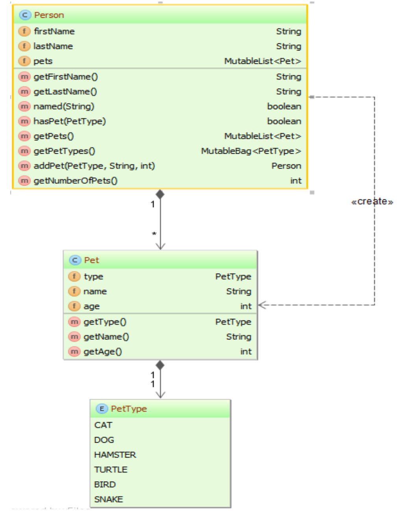
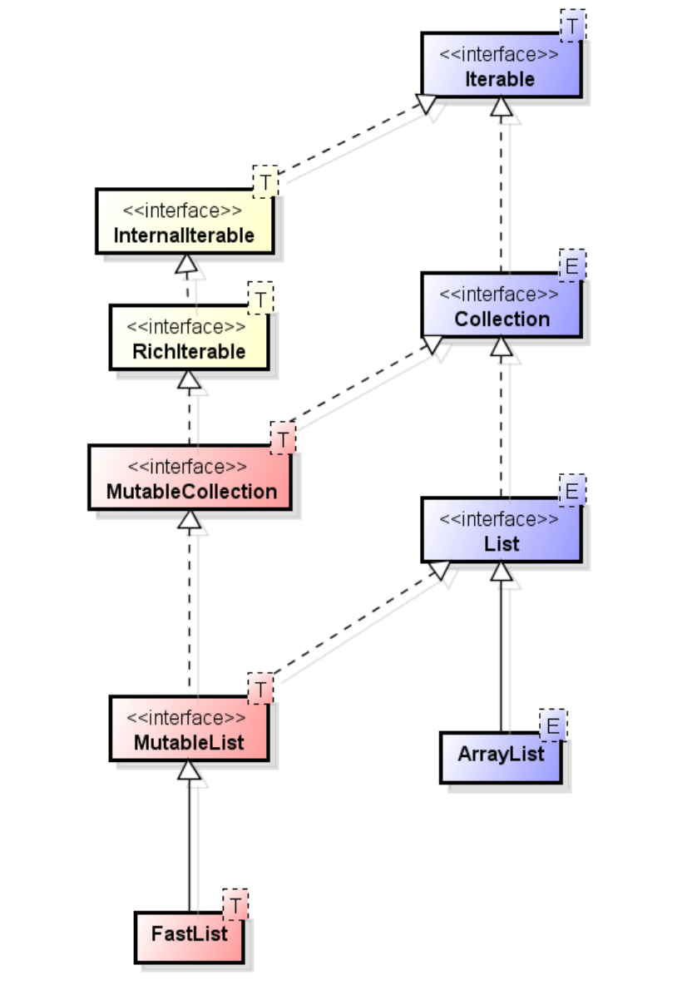
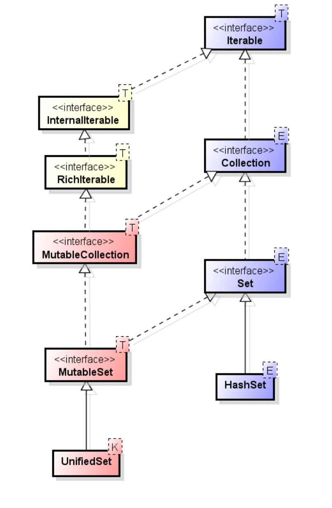
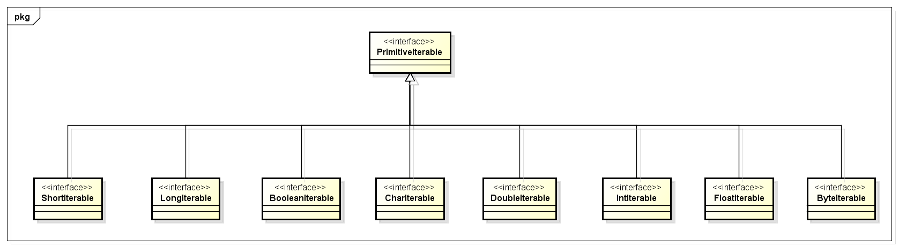
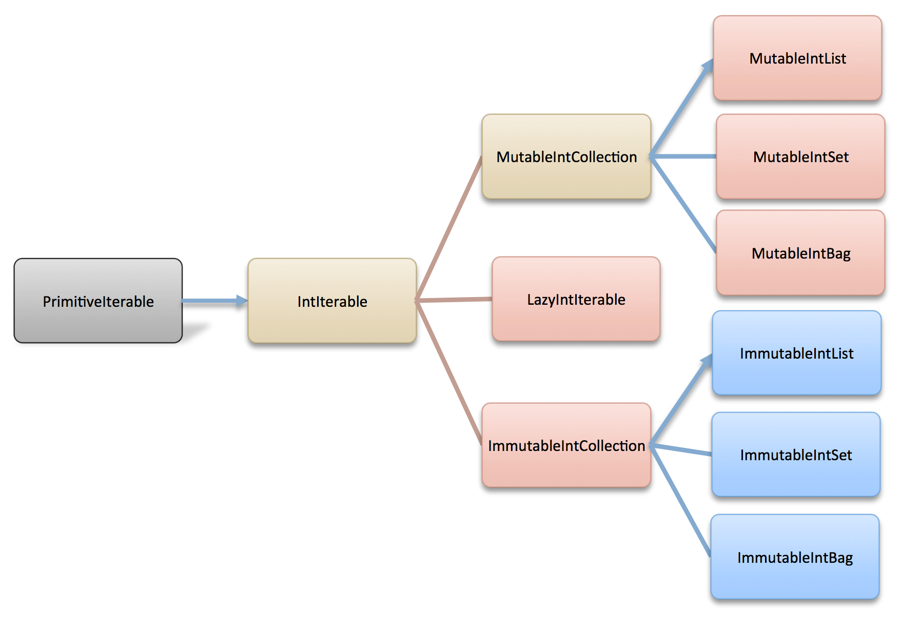

<!--
  ~ Copyright (c) 2018 Goldman Sachs and others.
  ~ All rights reserved. This program and the accompanying materials
  ~ are made available under the terms of the Eclipse Public License v1.0
  ~ and Eclipse Distribution License v. 1.0 which accompany this distribution.
  ~ The Eclipse Public License is available at http://www.eclipse.org/legal/epl-v10.html
  ~ and the Eclipse Distribution License is available at
  ~ http://www.eclipse.org/org/documents/edl-v10.php.
  -->
 <!-- .element style="background-color:aliceblue" -->

Pet Kata
========

Learning through exercises

* **space:** next page
* **down arrow:** next page in the current section
* **right arrow:** next section


### Pet Kata domain
 * Domain objects are initialized in ```PetDomainForKata```
 * Data is available to you through ```this.people``` 
 
 <!-- .element style="width:40%;background-color:aliceblue" -->


Exercise 1
==========

* **down:** New concepts for Exercise 1
* **right:** Exercise 1 solutions


Collect Pattern
---------------
 * _Collect_ Pattern (a.k.a. _map_ or _transform_).
 * Returns a new collection where each element has been transformed.
   * e.g. collect each pet's name.
 * __`Function`__ is the type that takes an object and returns an object of a different type.
   * a.k.a. _Transformer_.


Collect Pattern (legacy for loop)
---------------------------------

```java
List<Pet> pets = someCodeToGetPets();
List<String> petNames = new ArrayList<>();
for (Pet pet : pets)
{
  petNames.add(pet.getName());
}
```


Collect Pattern
---------------
(Eclipse Collections)
---------------------
```java
MutableList<Pet> pets = someCodeToGetPets();
```

Lambda
```java
MutableList<String> petNames = pets.collect(pet -> pet.getName());
```

Method Reference
```java
MutableList<String> petNames = pets.collect(Pet::getName);
```


Select Pattern
--------------
 * _Select_ Pattern (a.k.a. _filter_).
 * Returns the elements of collections that satisfy some condition.
   * e.g. select only those people who have a pet.
 * __`Predicate`__ is the type that takes an object and returns a boolean.


Select Pattern (legacy for loop)
---------------------------------

```java
List<Person> people = someCodeToGetPeople();
List<Person> petPeople = new ArrayList<>();
for (Person person : people)
{
  if (person.isPetPerson())
  {
    petPeople.add(person);
  }
}
```


Select Pattern
--------------
(Eclipse Collections)
---------------------

```java
MutableList<Person> people = someCodeToGetPeople();
```

Lambda
```java
MutableList<Person> petPeople = 
  people.select(person -> person.isPetPerson());
```

Method Reference
```java
MutableList<Person> petPeople = people.select(Person::isPetPerson);
```


Exercise 1
----------
 * Fix `Exercise1Test`; there are failing tests.
 * Figure out how to get the tests to pass using what you have seen so far.


Exercise 1 solutions
====================

* **down:** Exercise 1 solutions
* **right:** Exercise 2


Get first names of people
-------------------------
```java
@Test
public void getFirstNamesOfAllPeople()
{
  MutableList<String> firstNames =
    this.people.collect(Person::getFirstName);
  MutableList<String> expectedFirstNames =
    Lists.mutable.with("Mary", "Bob", "Ted", "Jake", "Barry", "Terry", "Harry", "John");
  Assert.assertEquals(expectedFirstNames, firstNames);
}
```


Get names of Mary Smith's Pets
------------------------------
```java
@Test
public void getNamesOfMarySmithsPets()
{
  Person person = this.getPersonNamed("Mary Smith");
  MutableList<Pet> pets = person.getPets();
  MutableList<String> names =
    pets.collect(eachPet -> eachPet.getName());
  Assert.assertEquals("Tabby", names.makeString());
}
```


Get people with cats
--------------------
```java
@Test
public void getPeopleWithCats()
{
  MutableList<Person> people = this.people;
  MutableList<Person> peopleWithCats =
    people.select(person -> person.hasPet(PetType.CAT));
  Verify.assertSize(2, peopleWithCats);
}
```


Get people without cats
-----------------------
```java
@Test
public void getPeopleWithoutCats()
{
  MutableList<Person> peopleWithoutCats =
    this.people.reject(person -> person.hasPet(PetType.CAT));
  Verify.assertSize(6, peopleWithoutCats);
}
```


Exercise 2
==========

* **down:** New concepts for Exercise 2
* **right:** Exercise 2 solutions


TestUtils
---------
 * Eclipse Collections distribution includes `eclipse-collections-testutils.jar`.
   * Includes helpful utility for writing unit tests.
   * Collection specific.
   * Implemented as an extension of JUnit.
   * Better error messages.
   * Most important class is called `Verify`.


TestUtils Code Example
----------------------

Example from previous solution
```java
Verify.assertSize(2, peopleWithCats);
```

Instead of
```java
Assert.assertEquals(2, peopleWithCats.size());
```


Flat Collect Pattern
--------------------
* `flatCollect()` is a special case of `collect()`
* With `collect()`, when the `Function` returns a collection, the result is collection of collections.

collect example
```java
MutableList<Person> people = ...;
Function<Person, Iterable<PetType>> function =
  person -> person.getPetTypes();
MutableList<MutableList<PetType>> pets = people.collect(function);
```


Flat Collect Pattern
--------------------
* `flatCollect()` outputs a single **flattened** collection instead of a collection of collections.
* The signature of `flatCollect()` is similar to `collect()`, except that the `Function` parameter _must_ map to an `Iterable` type.

Method Signature
```java
flatCollect(Function<? super T, ? extends Iterable<V>> function);
```

flatCollect example
```java
MutableList<Person> people = ...;
MutableList<PetType> pets =
  people.flatCollect(person -> person.getPetTypes());
```


More Iteration Patterns
-----------------------
* Patterns that use `Predicate`.
  * **`select`** returns the elements of a collection that satisfy the `Predicate`.
  * **`reject`** returns the elements of a collection that _do not_ satisfy the `Predicate`.
  * **`count`** returns the number of elements that satisfy the `Predicate`.


More Iteration Patterns
-----------------------
* Short-circuit pattern that use `Predicate`.
  * **`detect`** finds the first element that satisfies the `Predicate`.
  * **`anySatisfy`** returns true if any element satisfies the `Predicate`.
  * **`allSatisfy`** returns true if all elements satisfy the `Predicate`.
  * **`noneSatisfy`** returns true if no elements satisfy the `Predicate`.


### Inheritance Hierarchy (List)
* `MutableList` extends `List`
* `FastList` is a drop-in replacement for `ArrayList`

 <!-- .element style="width:35%;background-color:aliceblue" -->


### Inheritance Hierarchy (Set)
* `MutableSet` extends `Set`
* `UnifiedSet` is a drop-in replacement for `HashSet`

 <!-- .element style="width:35%;background-color:aliceblue" -->


With Methods
------------

**Review:** How can we filter people over a certain age?

```java
MutableList<Person> voters =
  people.select(person -> person.getAge() >= 18);
```

What if we want to find groups of people with different ages?


With Methods
------------
* `collect()`, `select()`, and `reject()` take a code block with a single parameter (`Function` and `Predicate`).
* `collectWith()`, `selectWith()`, and `rejectWith()` are alternate forms that take two parameters.
  * A code block that takes two parameters.
  * An object that gets passed as the second argument to the code block.
* Now the two-argument block is reusable.

```java
Predicate2<Person, Integer> olderThan =
  (person, age) -> person.getAge() >= age;
MutableList<Person> drivers = people.selectWith(olderThan, 17);
MutableList<Person> voters = people.selectWith(olderThan, 18);
MutableList<Person> drinkers = people.selectWith(olderThan, 21);
MutableList<Person> sunsetRobotSquad = people.selectWith(olderThan, 160);
```


With Methods
------------
* Most iteration patterns have a corresponding "With" form.
  * `collectWith()`
  * `selectWith()`
  * `detectWith()`
  * `anySatisfyWith()`
  * ...etc


With Methods
------------
* These forms allow you to use method references in more situations.

```java
MutableList<Person> peopleWithCatMethodReference =
  this.people.selectWith(Person::hasPet, PetType.CAT);
```

* This is a made-up syntax with `select()` that **does not compile**. Only `selectWith()` allows us to use a method reference here.

```java
// Does NOT compile
MutableList<Person> peopleWithCatsLambda =
  this.people.select(Person::hasPet(PetType.CAT));
```


Exercise 2
----------
 * Fix `Exercise2Test`; they have failures.
 * Use the other iteration patterns that take a `Predicate`.
 * Use the `flatCollect` pattern.


Exercise 2 solutions
====================

* **down:** Exercise 2 solutions
* **right:** Exercise 3


Do any people have cats
-----------------------
```java
@Test
public void doAnyPeopleHaveCats()
{
  Predicate<Person> predicate = person -> person.hasPet(PetType.CAT);
  Assert.assertTrue(this.people.anySatisfy(predicate));
}
```


Do all people have pets
-----------------------
```java
@Test
public void doAllPeopleHavePets()
{
  Predicate<Person> predicate = person -> person.isPetPerson();
  Assert.assertFalse(this.people.allSatisfy(predicate));
}
```


How many people have cats
-------------------------
```java
@Test
public void howManyPeopleHaveCats()
{
  int count = this.people.count(person -> person.hasPet(PetType.CAT));
  Assert.assertEquals(2, count);
}
```


Find Mary Smith
---------------
```java
@Test
public void findMarySmith()
{
  Person result = this.people.detectWith(Person::named, "Mary Smith");
  Assert.assertEquals("Mary", result.getFirstName());
  Assert.assertEquals("Smith", result.getLastName());
}
```


Get People With Pets
--------------------
```java
@Test
public void getPeopleWithPets()
{
  // Replace with only the pet owners.
  MutableList<Person> petPeople = this.people.select(person -> person.isPetPerson());
  Verify.assertSize(7, petPeople);
}
```


Get all PetTypes of all people
------------------------------
```java
@Test
public void getAllPetTypesOfAllPeople()
{
  Function<Person, Iterable<PetType>> function = person -> person.getPetTypes();
  MutableSet<PetType> petTypes = this.people.flatCollect(function, Sets.mutable.empty());
  Assert.assertEquals(
    Sets.mutable.with(PetType.CAT, PetType.DOG, PetType.TURTLE, PetType.HAMSTER, PetType.BIRD, PetType.SNAKE),
    petTypes);
}
```


Get first name of all people
----------------------------
```java
@Test
public void getFirstNamesOfAllPeople()
{
  MutableList<String> firstNames = this.people.collect(Person::getFirstName);
  Assert.assertEquals(
    Lists.mutable.with("Mary", "Bob", "Ted", "Jake", "Barry", "Terry", "Harry", "John"),
    firstNames);
}
```


Do any people have cats (refactor)
----------------------------------
```java
@Test
public void doAnyPeopleHaveCatsRefactor()
{
  boolean peopleHaveCatsLambda = this.people.anySatisfy(person -> person.hasPet(PetType.CAT));
  Assert.assertTrue(peopleHaveCatsLambda);

  // Use a method reference, NOT a lambda, to solve the problem below.
  boolean peopleHaveCatsMethodRef = this.people.anySatisfyWith(Person::hasPet, PetType.CAT);
  Assert.assertTrue(peopleHaveCatsMethodRef);
}
```


Do all people have cats (refactor)
----------------------------------
```java
@Test
public void doAllPeopleHaveCatsRefactor()
{
  boolean peopleHaveCatsLambda = this.people.allSatisfy(person -> person.hasPet(PetType.CAT));
  Assert.assertFalse(peopleHaveCatsLambda);

  // Use a method reference, NOT a lambda, to solve the problem below.
  boolean peopleHaveCatsMethodRef = this.people.allSatisfyWith(Person::hasPet, PetType.CAT);
  Assert.assertFalse(peopleHaveCatsMethodRef);
}
```


Get people with cats (refactor)
-------------------------------
```java
@Test
public void getPeopleWithCatsRefator()
{
  // Use a method reference, NOT a lambda, to solve the problem below.
  MutableList<Person> peopleWithCatsMethodRef = this.people.selectWith(Person::hasPet, PetType.CAT);
  Verify.assertSize(2, peopleWithCatsMethodRef);
}
```


Get people without cats (refactor)
-------------------------------
```java
@Test
public void getPeopleWithoutCatsRefactor()
{
  // Use a method reference, NOT a lambda, to solve the problem below.
  MutableList<Person> peopleWithoutCatsMethodRef = this.people.rejectWith(Person::hasPet, PetType.CAT);
  Verify.assertSize(6, peopleWithoutCatsMethodRef);
}
```


Exercise 3
==========

* **down:** New concepts for Exercise 3
* **right:** Exercise 3 solutions


Bag
===


Bag
---

* Useful when you would otherwise use `Map<K, Integer>`
  * For example, to track the count of each PetType.
  * a.k.a. Multiset, Histogram
* Using a `Map`, how should we fill in the blank?

```java
MutableList<Person> people = ...;
MutableList<PetType> pets = people.flatCollect(Person::getPetTypes);
MutableMap<PetType, Integer> petTypeCounts = Maps.mutable.empty();
// ???
int cats = petTypeCounts.get(PetType.CAT);
```


Bag
---

```java
MutableMap<PetType, Integer> petTypeCounts = Maps.mutable.empty();
for (PetType petType : pets)
{
  Integer count = petTypeCounts.get(petType);
  if (count == null)
  {
    count = 0;
  }
  petTypeCounts.put(petType, count + 1);
}
```

* Lot of boilerplate code to handle uninitialized counts.


Bag
---

* `Bag` is implemented as a map of key to count.
* Like a `List`, but unordered.
* Like a `Set`, but allows duplicates.

```java
MutableBag<PetType> petTypeCounts = pets.toBag();
int cat = petTypeCounts.occurrencesOf(PetType.CAT);
```


Bag
---

|Methods                                 |Inherited from                            |
|:---------------------------------------|------------------------------------------|
|`select()`, `collect()`, etc.           |`RichIterable`                            |
|`add()`, `remove()`, `iterator()`, etc. |`MutableCollection` (`java.util.Collection`)|
|`occurencesOf()`, `forEachWithOccurences()`, `toMapOfItemToCount()`|`Bag`          |
|`addOccurences()`, `removeOccurences()` |`MutableBag`                              |


Bag
---

```java
MutableBag<String> bag =
  Bags.mutable.with("one", "two", "two", "three", "three", "three");

Assert.assertEquals(3, bag.occurrencesOf("three"));

bag.add("one");
Assert.assertEquals(2, bag.occurrencesOf("one"));

bag.addOccurrences("one", 4);
Assert.assertEquals(6, bag.occurrencesOf("one"));
```


Multimap
========


Multimap
--------
* `Multimap` is similar to Map, but associates a key to *multiple values*.
* Useful when you would otherwise use `Map<K, Collection<V>>`
  * For example, group people with same last name.

```java
MutableList<Person> people = ...;
MutableMap<String, MutableList<Person>> lastNamesToPeople =
  Maps.mutable.empty();
// ???
MutableList<Person> smiths = lastNamesToPeople.get("Smith");
```


Multimap
--------
* Code to populated the `Map<K, Collection<V>>`
* Lot of boilerplate code to handle uninitialized backing collections.

```java
MutableMap<String, MutableList<Person>> lastNamesToPeople =
  Maps.mutable.empty();

for (Person person : people)
{
  String lastName = person.getLastName();
  MutableList<Person> peopleWithLastName =
    lastNamesToPeople.get(lastName);

  if (peopleWithLastName == null)
  {
    peopleWithLastName = Lists.mutable.empty();
    lastNamesToPeople.put(lastName, peopleWithLastName);
  }
  peopleWithLastName.add(person);
}
MutableList<Person> smiths = lastNamesToPeople.get("Smith");
```


Multimap
--------

* Using `Multimap` for the same example

```java
MutableListMultimap<String, Person> lastNamesToPeople =
  people.groupBy(Person::getLastName);

MutableList<Person> smiths = lastNamesToPeople.get("Smith");
```


Multimap
--------
* What happens if you add the same key and value twice?
* It depends on which type of multimap. <!-- .element: class="fragment fade-in" -->

```java
MutableMultimap<String, Person> multimap = ...;
multimap.put("Smith", person);
multimap.put("Smith", person);
RichIterable<Person> smiths = multimap.get("Smith");

Verify.assertIterableSize(???, smiths);
```


Multimap
--------
* When the multimap is a `ListMultimap`, the groups of values are lists, which allow duplicates.

```java
MutableListMultimap<String, Person> multimap =
  Multimaps.mutable.list.empty();
multimap.put("Smith", person);
multimap.put("Smith", person);
MutableList<Person> smiths = multimap.get("Smith");

Verify.assertIterableSize(2, smiths);
```


Multimap
--------
* When the multimap is a `SetMultimap`, the groups of values are sets, which don't allow duplicates.

```java
MutableSetMultimap<String, Person> multimap =
  Multimaps.mutable.set.empty();
multimap.put("Smith", person);
multimap.put("Smith", person);
MutableSet<Person> smiths = multimap.get("Smith");

Verify.assertIterableSize(1, smiths);
```


Multimap
--------

* `groupByEach()` is a special case of `groupBy()`.
* Analogous to the difference between `collect()` and `flatCollect()`.
* Appropriate when the `Function` returns an `Iterable`.
* The return type is the same as `groupBy()`: `Multimap`.

```java
MutableListMultimap<String, Person> lastNamesToPeople =
  people.groupBy(Person::getLastName);

MutableListMultimap<PetType, Person> petsToPeople =
  people.groupByEach(person -> person.getPets().collect(Pet::getType);
```


Target Collections
==================


Target Collections
------------------

* Let's say we have 3 people: mrSmith, mrsSmith, mrJones.
* The first two share the same address.
* What will get printed by the following code?

```java
MutableSet<Person> people =
  Sets.mutable.with(mrSmith, mrsSmith, mrJones);

int numAddresses =
  people.collect(Person::getAddress).size();

System.out.println(numAddresses);
```


Target Collections
------------------

* `select()`, `collect()`, etc. are defined with covariant return types:
  * `MutableCollection.collect()` returns a `MutableCollection`.
  * `MutableList.collect()` returns a `MutableList`.
  * `MutableSet.collect()` returns a `MutableSet`.


Target Collections
------------------

* Alternate forms take target collections.
* These forms return the same instance passed in as the target.

```java
MutableSet<Person> people =
  Sets.mutable.with(mrSmith, mrsSmith, mrJones);

MutableList<Address> targetList = Lists.mutable.empty();

int numAddresses =
  people.collect(Person::getAddress, targetList).size();

System.out.println(numAddresses);
```


Exercise 3
----------
 * Fix `Exercise3Test`; they have failures.
 * Use `Bag`, `Multimap`.


Exercise 3 solutions
====================

* **down:** Exercise 3 solutions
* **right:** Exercise 4


Get counts by pet type
----------------------
```java
@Test
public void getCountsByPetType()
{
  MutableBag<PetType> counts =
    this.people.flatCollect(Person::getPets).countBy(Pet::getType);

  Assert.assertEquals(2, counts.occurrencesOf(PetType.CAT));
  Assert.assertEquals(2, counts.occurrencesOf(PetType.DOG));
  Assert.assertEquals(2, counts.occurrencesOf(PetType.HAMSTER));
  Assert.assertEquals(1, counts.occurrencesOf(PetType.SNAKE));
  Assert.assertEquals(1, counts.occurrencesOf(PetType.TURTLE));
  Assert.assertEquals(1, counts.occurrencesOf(PetType.BIRD));
}
```


Get people by last name
-----------------------
```java
@Test
public void getPeopleByLastName()
{
  MutableListMultimap<String, Person> lastNamesToPeople =
    this.people.groupBy(Person::getLastName);

  Verify.assertIterableSize(3, lastNamesToPeople.get("Smith"));
}
```


Get people by their pets
------------------------
```java
@Test
public void getPeopleByTheirPets()
{
  MutableSetMultimap<PetType, Person> peopleByPetType =
    this.people.groupByEach(
      Person::getPetTypes,
	  Multimaps.mutable.set.empty());

  Verify.assertIterableSize(2, peopleByPetType.get(PetType.CAT));
  Verify.assertIterableSize(2, peopleByPetType.get(PetType.DOG));
  Verify.assertIterableSize(1, peopleByPetType.get(PetType.HAMSTER));
  Verify.assertIterableSize(1, peopleByPetType.get(PetType.TURTLE));
  Verify.assertIterableSize(1, peopleByPetType.get(PetType.BIRD));
  Verify.assertIterableSize(1, peopleByPetType.get(PetType.SNAKE));
}
```


Exercise 4
==========

* **down:** New concepts for Exercise 4
* **right:** Exercise 4 solutions


Primitive Collections
=====================


Primitive Collections
---------------------

* Each data structure has an analogous primitive version.
* All primitive types are supported.


Primitive Collections
---------------------
All 8 primitive collection interfaces

 <!-- .element style="background-color:aliceblue" -->


Primitive Collections
---------------------

 <!-- .element style="width:75%;background-color:aliceblue" -->


Primitive Collections
---------------------
* Primitive collections have the same rich and fluent API as regular collections.

Code Example

```java
MutableIntList intListOfAges = this.people
  .flatCollect(Person::getPets)
  .collectInt(Pet::getAge);

MutableIntList selection =
  intListOfAges.select(age -> age > 2);

MutableIntSet intSetOfAges = intListOfAges.toSet();
```


Exercise 4
----------
 * Fix `Exercise4Test`; they have failures.
 * Refactor Java 8 streams to Eclipse Collections.


Exercise 4 solutions
====================

* **down:** Exercise 4 solutions
* **right:** Exercise 5


Get age statistics of pets
--------------------------
```java
@Test
public void getAgeStatisticsOfPets()
{
  // Try to use a MutableIntList here instead
  // Hints: flatMap = flatCollect, map = collect, mapToInt = collectInt
  MutableIntList petAges = this.people
      .flatCollect(Person::getPets)
      .collectInt(Pet::getAge);

  // Try to use an IntSet here instead
  IntSet uniqueAges = petAges.toSet();

  // IntSummaryStatistics is a class in JDK 8 - Try and use it with MutableIntList.forEach().
  IntSummaryStatistics stats = new IntSummaryStatistics();
  petAges.forEach(stats::accept);

  // Is a Set<Integer> equal to an IntSet?
  // Hint: Try IntSets instead of Sets as the factory
  Assert.assertEquals(IntSets.immutable.of(1, 2, 3, 4), uniqueAges);

  // Try to leverage min, max, sum, average from the Eclipse Collections Primitive API
  Assert.assertEquals(stats.getMin(), petAges.min());
  Assert.assertEquals(stats.getMax(), petAges.max());
  Assert.assertEquals(stats.getSum(), petAges.sum());
  Assert.assertEquals(stats.getAverage(), petAges.average(), 0.0);
  Assert.assertEquals(stats.getCount(), petAges.size());

  // Hint: Match = Satisfy
  Assert.assertTrue(petAges.allSatisfy(IntPredicates.greaterThan(0)));
  Assert.assertTrue(petAges.allSatisfy(i -> i > 0));
  Assert.assertFalse(petAges.anySatisfy(i -> i == 0));
  Assert.assertTrue(petAges.noneSatisfy(i -> i < 0));
  Assert.assertEquals(2.0d, petAges.median(), 0.0);
}
```


Stream to EC refactor #1
------------------------
```java
@Test
public void streamsToECRefactor1()
{
  // Find Bob Smith
  Person person = this.people.detect(each -> each.named("Bob Smith"));

  // Get Bob Smith's pets' names
  String names = person.getPets()
    .collect(Pet::getName)
    .makeString(" & ");

  Assert.assertEquals("Dolly & Spot", names);
}
```


Stream to EC refactor #2
------------------------
```java
@Test
public void streamsToECRefactor2()
{
  // Hint: Try to replace the Map<PetType, Long> with a Bag<PetType>
  MutableBag<PetType> counts = this.people
    .asUnmodifiable()
    .flatCollect(Person::getPets)
    .countBy(Pet::getType);

  Assert.assertEquals(2, counts.occurrencesOf(PetType.CAT));
  Assert.assertEquals(2, counts.occurrencesOf(PetType.DOG));
  Assert.assertEquals(2, counts.occurrencesOf(PetType.HAMSTER));
  Assert.assertEquals(1, counts.occurrencesOf(PetType.SNAKE));
  Assert.assertEquals(1, counts.occurrencesOf(PetType.TURTLE));
  Assert.assertEquals(1, counts.occurrencesOf(PetType.BIRD));
}
```


Stream to EC refactor #3
------------------------
```java
@Test
public void streamsToECRefactor3()
{
  // Hint: The result of groupingBy/counting can almost always be replaced by a Bag
  // Hint: Look for the API on Bag that might return the top 3 pet types
  MutableList<ObjectIntPair<PetType>> favorites = this.people
    .flatCollect(Person::getPets)
    .countBy(Pet::getType)
    .topOccurrences(3);

  Verify.assertSize(3, favorites);
  Verify.assertContains(PrimitiveTuples.pair(PetType.CAT, 2), favorites);
  Verify.assertContains(PrimitiveTuples.pair(PetType.DOG, 2), favorites);
  Verify.assertContains(PrimitiveTuples.pair(PetType.HAMSTER, 2), favorites);
}
```


Exercise 5
==========

* Exercise 5 is extra-credit.
* Use methods on [RichIterable](https://www.eclipse.org/collections/javadoc/8.0.0/org/eclipse/collections/api/RichIterable.html).
* **Go right:** Learn Exercise 5 solutions


Partition pet and non pet people
--------------------------------
```java
@Test
public void partitionPetAndNonPetPeople()
{
  PartitionMutableList<Person> partitionMutableList = this.people
    .partition(Person::isPetPerson);

  Verify.assertSize(7, partitionMutableList.getSelected());
  Verify.assertSize(1, partitionMutableList.getRejected());
}
```


Get oldest pet
--------------
```java
@Test
public void getOldestPet()
{
  Pet oldestPet = this.people
    .flatCollect(Person::getPets)
    .maxBy(pet -> pet.getAge());

  Assert.assertEquals(PetType.DOG, oldestPet.getType());
  Assert.assertEquals(4, oldestPet.getAge());
}
```


Get average pet age
-------------------
```java
@Test
public void getAveragePetAge()
{
  double averagePetAge = this.people
    .flatCollect(Person::getPets)
    .collectDouble(pet -> pet.getAge())
    .average();

  Assert.assertEquals(1.8888888888888888, averagePetAge, 0.00001);
}
```


Add pet ages to existing set
----------------------------
```java
@Test
public void addPetAgesToExistingSet()
{
  // Hint: Use petAges as a target collection
  MutableIntSet petAges = IntSets.mutable.with(5);

  this.people.flatCollect(Person::getPets)
    .collectInt(pet -> pet.getAge(), petAges);

  Assert.assertEquals(IntSets.mutable.with(1, 2, 3, 4, 5), petAges);
}
```


Refactor to Eclipse Collections
-------------------------------
```java
@Test
public void refactorToEclipseCollections()
{
  // Replace List and ArrayList with Eclipse Collections types
  MutableList<Person> people = Lists.mutable.with(
    new Person("Mary", "Smith").addPet(PetType.CAT, "Tabby", 2),
    new Person("Bob", "Smith")
        .addPet(PetType.CAT, "Dolly", 3)
        .addPet(PetType.DOG, "Spot", 2),
    new Person("Ted", "Smith").addPet(PetType.DOG, "Spike", 4),
    new Person("Jake", "Snake").addPet(PetType.SNAKE, "Serpy", 1),
    new Person("Barry", "Bird").addPet(PetType.BIRD, "Tweety", 2),
    new Person("Terry", "Turtle").addPet(PetType.TURTLE, "Speedy", 1),
    new Person("Harry", "Hamster")
        .addPet(PetType.HAMSTER, "Fuzzy", 1)
        .addPet(PetType.HAMSTER, "Wuzzy", 1),
    new Person("John", "Doe")
  );

  // Replace Set and HashSet with Eclipse Collections types
  MutableIntSet petAges = people
    .flatCollect(Person::getPets)
    .collectInt(pet -> pet.getAge())
    .toSet();

  // Extra bonus - convert to a primitive collection
  Assert.assertEquals(IntSets.mutable.with(1, 2, 3, 4), petAges);
}
```


Congratulations!
================

You have completed the Pet Kata!

Enjoy happy Java development with Eclipse Collections!
