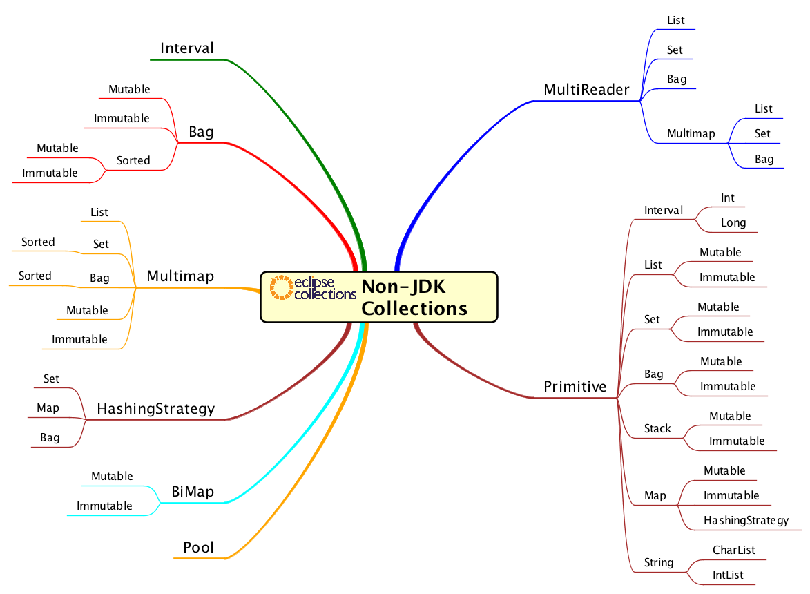

<!--
  ~ Copyright (c) 2022 The Bank of New York Mellon.
  ~ All rights reserved. This program and the accompanying materials
  ~ are made available under the terms of the Eclipse Public License v1.0
  ~ and Eclipse Distribution License v. 1.0 which accompany this distribution.
  ~ The Eclipse Public License is available at http://www.eclipse.org/legal/epl-v10.html
  ~ and the Eclipse Distribution License is available at
  ~ http://www.eclipse.org/org/documents/edl-v10.php.
  -->
# **What is the Lost and Found Kata?**
The Lost and Found Kata is an advanced Code Kata with a set exercises that a developer can complete to familiarize themselves with a broad set of the data structures and APIs available in [Eclipse Collections](https://github.com/eclipse/eclipse-collections), many of which will have no equivalent in the JDK today. The target audience for this kata are contributors who are looking to learn Eclipse Collections in depth and potentially become committers on the library.

There are three sections to the kata. Each section was covered in depth in a separate blog that was part of a three part blog series.

* Non-JDK Data Structures
  * [Blog: The missing Java data structures no one ever told you about - Part 1](https://medium.com/javarevisited/the-missing-java-data-structures-no-one-ever-told-you-about-part-1-f45b6d0ee969?source=friends_link&sk=5d47f3f673046886e998ad54116a7af9) 
  * [Exercises](src/test/java/org/eclipse/collections/lostandfoundkata/datastructures)
* MultiReader Collections
  * [Blog: The missing Java data structures no one ever told you about - Part 2](https://medium.com/javarevisited/the-missing-java-data-structures-no-one-ever-told-you-about-part-2-f484a588cce3?source=friends_link&sk=7022918ce830f2d8b94d9926e832de7d)
  * [Exercises](src/test/java/org/eclipse/collections/lostandfoundkata/multireader)
* Primitive Collections
  * [Blog: The missing Java data structures no one ever told you about - Part 3](https://medium.com/javarevisited/the-missing-java-data-structures-no-one-ever-told-you-about-part-3-d26387b9e66e?source=friends_link&sk=00643d5a044cfa85514cd583963048ce)
  * [Exercises](src/test/java/org/eclipse/collections/lostandfoundkata/primitive)

